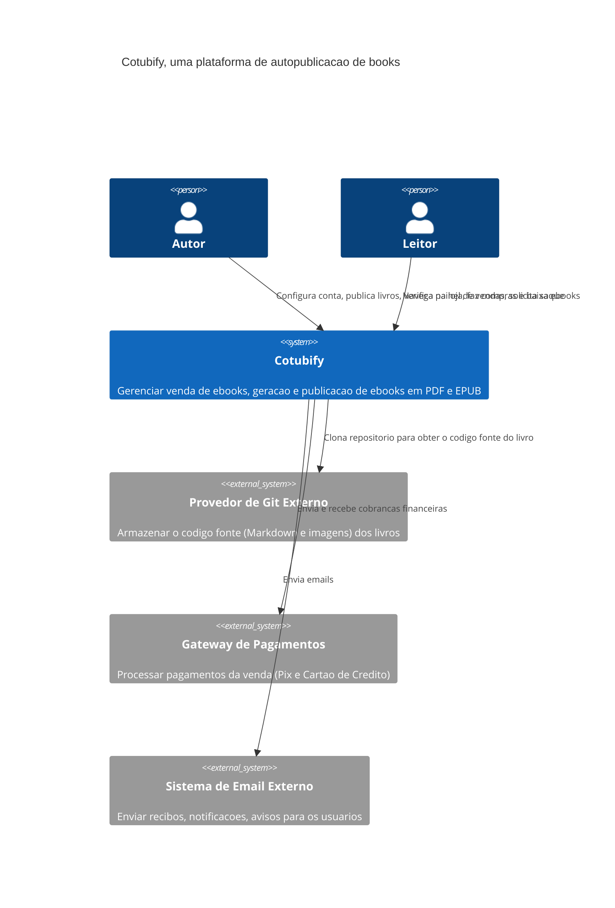
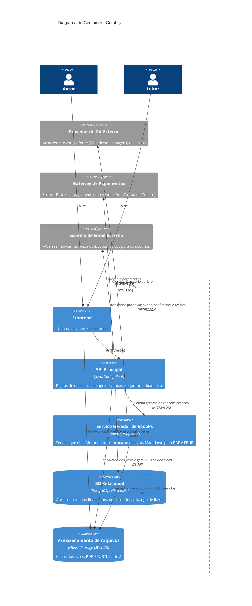

# Arquitetura Cotubify

O Cotubify eh uma plataforma de autopublicacao e venda de ebooks.

O sistema permite autores tecnicos conectarem repositorio Git com arquivos no formato Markdown para geracao automatizada de ebooks nos formatos PDF e EPUB. Os autores tambem tem um painel de vendas.

Permite tambem que os leitores acessem uma loja online para navegacao, compra e download das obras. Os leitores recebem recibos e notificacoes via email.

## Diagrama do Contexto (C4 Model)

## Diagrama de Containers (C4 Model)

